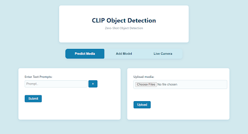
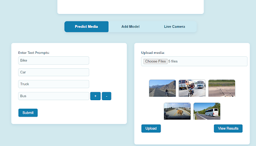

# Adaptive Multimodal Inference with CLIP-Based Model Gating
## Project Idea
During this project, I explored various efficient multimodal inference pipelines and implemented a CLIP-based model-gating mechanism.

Instead of running multiple YOLO models on every image - which is slow and inefficient - I used CLIP embeddings to semantically compare:
* the image input
* the textual descriptions/ prompts associated with each model

This allowed the system to select only the most relevant model(s) for inference, making the pipeline lightweight, and more suitable for edge devices operating in real-time.

## Working

1. CLIP embeddings are generated for:
  - A given image
  - Text prompts tied to each YOLO model
    
2. Cosine similarity between the two embeddings are calculated
     
3. The top models are selected instead of invoking all of them
   
4. Inference is run only on those selected models, reducing computation and latency

## Implementation

I built a full-stack application to demonstrate the pipeline:

### Frontend - React
* Webcam Capture for Real-time inference
* File Upload (Images + model .pt files )
* Inputs for custom text-prompts
* Three main tabs - (Predict Media, Add Model, Live Camera)



### Backend - Flask
* CLIP embedding generation for images & text
* YOLO model storage and loading
* Adaptive Model selection logic
* REST endpoints for media prediction & live camera inference

## Application Features

1. Predict Media

Users can upload images and provide any number of text prompts.
The system computes CLIP similarity scores and returns the most likely prompts present in the image with an associated probability score.




2. Add Model

Users can upload YOLO model weights, along with the associated text prompts to be used for Live Webcam inference.

3. Live Camera

A real-time webcam inference view where the uploaded models are used to draw inference. 
There is also an option to enter text prompts to make predictions on the live frames.

## Installation

### **1. Clone the Repository**

`git clone <your-repo-url>`

`cd <your-project-folder>`

### **2. Backend setup (Flask)**

Use `pip install -r requirements.txt` to install dependencies

### **3. Run the Flask Server**

flask run

### **4. Frontend Setup**

Run the following commands:

```bash
cd app
npm install
npm start
```

### **Important Note**

Please ensure to enter text-prompts and press submit before uploading media for inference!
